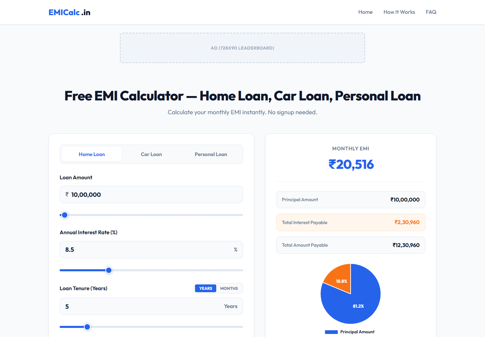
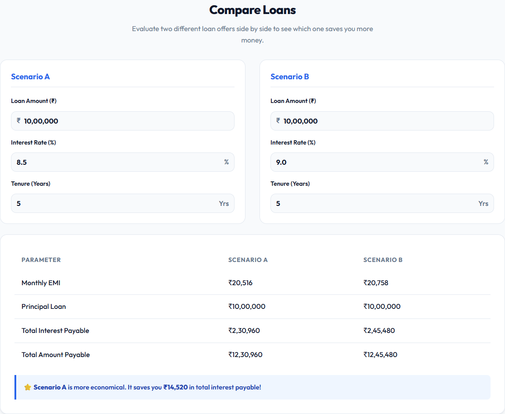
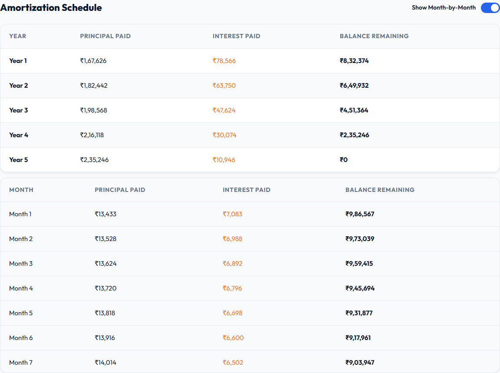
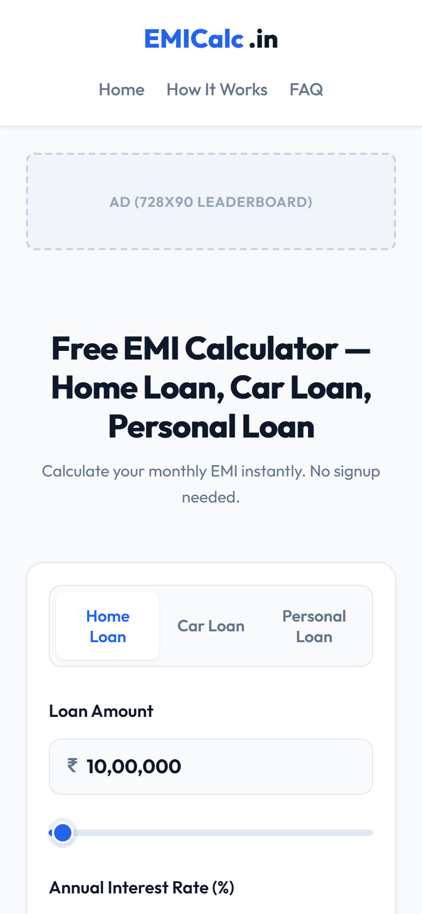

# EMICalc — EMI Calculator

A fast, free, no-signup EMI calculator for **Home Loans, Car Loans and Personal Loans**, built as a single static web page. Enter a loan amount, interest rate and tenure to get your monthly EMI instantly, along with a principal-vs-interest breakdown, a full amortization schedule and a side-by-side loan comparison.



---

## Features

- **Three loan types:** switch between Home Loan, Car Loan and Personal Loan tabs.
- **Sliders and inputs stay in sync:** drag a slider or type a value and the other one updates.
  - Loan amount: ₹10,000 to ₹10 Crore
  - Interest rate: 1% to 30% p.a.
  - Tenure: switch between **Years** and **Months**
- **Indian number formatting:** amounts are shown in ₹ with lakh/crore grouping (e.g. `₹10,00,000`).
- **Instant results:** Monthly EMI, Principal Amount, Total Interest Payable and Total Amount Payable.
- **Pie chart:** principal vs. interest split, with percentage labels, drawn with Chart.js.
- **Share result:** copies a summary of your calculation to the clipboard.
- **Compare Loans:** put two loan offers (Scenario A and Scenario B) side by side and see which one saves you more interest.
- **Amortization schedule:** a year-by-year table, plus an optional month-by-month breakdown.
- **Learning content:** what EMI is, how it's calculated, loan types, and tips to reduce your EMI.
- **FAQ accordion:** eight common questions about EMIs.
- **Responsive:** works on desktop, tablet and mobile.
- **SEO-ready:** meta description, keywords and Open Graph tags, plus AdSense placeholder slots.

---

## Screenshots

### Calculator (desktop)


### Compare Loans


### Amortization Schedule (yearly + monthly)


### Mobile view


---

## How EMI Is Calculated

The calculator uses the standard reducing-balance EMI formula:

```
EMI = P × r × (1 + r)^n / ((1 + r)^n − 1)
```

| Symbol | Meaning |
|--------|---------|
| **P** | Principal (loan amount) |
| **r** | Monthly interest rate = Annual rate ÷ 12 ÷ 100 |
| **n** | Loan tenure in months |

**Example:** ₹10,00,000 at 8.5% for 5 years gives an EMI of **₹20,516**, with total interest of **₹2,30,960**.

---

## Tech Stack

| Layer | Used |
|-------|------|
| Markup / Styling | HTML5, CSS3 (custom properties, Grid, Flexbox) |
| Logic | Vanilla JavaScript (no framework, no build step) |
| Charts | [Chart.js](https://www.chartjs.org/) + [chartjs-plugin-datalabels](https://chartjs-plugin-datalabels.netlify.app/) (via CDN) |
| Font | [Outfit](https://fonts.google.com/specimen/Outfit) (Google Fonts) |
| Dev server | [`serve`](https://www.npmjs.com/package/serve) via `npx` |

---

## Getting Started

### Prerequisites
- A modern web browser
- [Node.js](https://nodejs.org/) (only needed if you want to use the local dev server)

### Run locally

```bash
# Clone the repository
git clone https://github.com/shreyashk07004/emi-calc.git
cd emi-calc

# Start a local server at http://localhost:3000
npm start
```

**Or skip Node:** open `index.html` in your browser. An internet connection is needed to load Chart.js and the font from their CDNs.

---

## Project Structure

```
emi-calc/
├── index.html      # The whole app: markup, styles and JavaScript
├── package.json    # npm "start" script (static server)
├── screenshots/    # Images used in this README
└── README.md
```

---

## Deployment

The site is a single static file, so you can host it on any static host, such as **GitHub Pages**, **Netlify** or **Vercel**. Just point the host at the repository root. Before going live, update the `canonical` URL in `index.html` and replace the AdSense placeholders with real ad units.

---

## Disclaimer

This calculator is for informational purposes only and is not financial advice. Actual loan amounts, rates and EMIs depend on your lender's terms.

## License

ISC (as declared in `package.json`).
